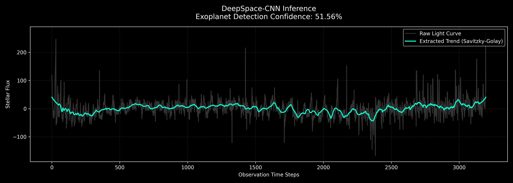
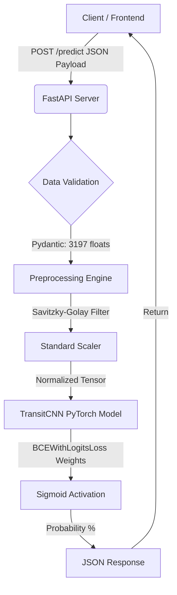

# DeepSpace: Exoplanet Transit Anomaly Detection

1D-Convolutional Neural Network (CNN) built in PyTorch to isolate exoplanetary transit signals from highly stochastic Kepler Space Telescope light curves.

## The Engineering Constraint: 135:1 Class Imbalance
The primary bottleneck of the Kepler dataset is extreme class imbalance. 
* **Classical Baseline:** Random Forest achieved 99% global accuracy by collapsing into a lazy prediction state (predicting "Empty Star" for all inputs). **Result: 0% Recall.**
* **Standard Deep Learning:** Baseline CNN overfit the training data (0.0031 Loss) while failing to capture the minority class. 

## Architecture & Data Pipeline
* **Signal Extraction:** Implemented Savitzky-Golay filtering (window=101, polyorder=2) to extract underlying geometric transit trends from stochastic stellar noise prior to scaling.
* **Network Design:** 3-layer 1D-CNN utilizing `MaxPool1d` to compress 3,197 temporal observation steps down to 49 spatial features.
* **Loss Function Engineering:** Bypassed the zero-recall trap via a custom `BCEWithLogitsLoss` weight matrix.

## Hyperparameter Optimization Log
To force the network to isolate the minority class without triggering systemic false positives, the loss penalty was tuned empirically:
1. **The Sledgehammer (135.0x Penalty):** Forced the network to hunt planets. Achieved 100% Recall, but destroyed Precision (1%, resulting in 971 false positives).
2. **Stochastic Stabilization:** Locked all Python, NumPy, and PyTorch CUDA seeds to prevent non-deterministic gradient collapse during tuning.
3. **Binary Search (Final State):** Dialed the weighted loss penalty down to exactly **7.0x**. This stabilized the decision boundary, catching transit anomalies while aggressively suppressing hallucinations.

## Local Inference
Model weights are saved locally to avoid expensive retraining.

1. Clone the repository.
2. Ensure `exoTest.csv` and `precision_weights.pth` are in the root directory.
3. Execute `python predict.py` to process the test set and generate the confidence visualization graph.
